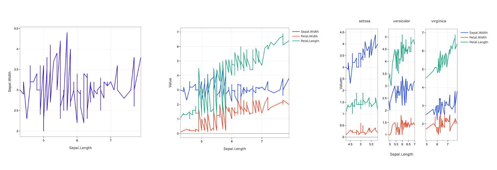
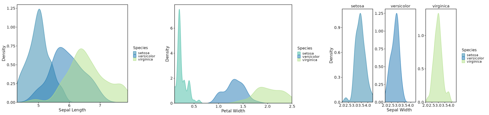
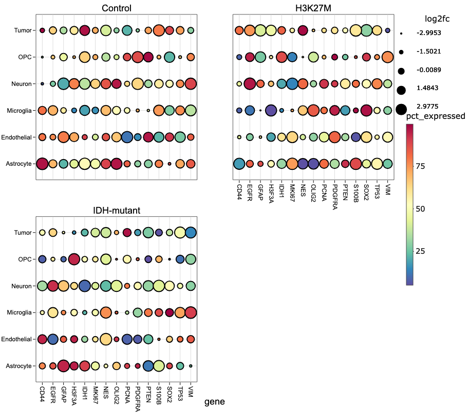

# VizModules

<!-- badges: start -->
[](https://github.com/j-andrews7/VizModules/actions/workflows/R-CMD-check.yaml)
[](https://github.com/j-andrews7/VizModules/actions/workflows/pkgdown.yaml)
<!-- badges: end -->

This package utilizes various viz packages (currently [dittoViz](https://github.com/dtm2451/dittoViz) and [plotthis](https://github.com/pwwang/plotthis) along with native plotting functions) to create interactivity-first Shiny modules for common plot types, designed to serve as building blocks for Shiny apps and as the basis for more complex/specialized modules.

These modules contain all possible functionality for each plot with some additional parameters that make use of the interactive features of plotly, e.g. interactive text annotations, arbitrary shape annotations, multiple download formats, etc.

The modules provide comprehensive plot control for app users, allowing for convenient aesthetic customizations and publication-quality images.
They also provide developers a way to dramatically save time and reduce complexity of their plotting code or a flexible base to build more specialized Shiny modules upon.

## Install

```r
# CRAN
install.packages("VizModules")

# Development version
remotes::install_github("j-andrews7/VizModules")
```

## Quick Start

- Explore the hosted example gallery: <https://j-andrews7-vizmodules.share.connect.posit.cloud/>
- Run the same gallery locally after installation: `shiny::runApp(system.file("apps/module-gallery", package = "VizModules"))`
- Check out the included Figure Builder app for a demo of how the modules can be used together to build a free-form, multi-pane figure: https://j-andrews7-vizmodulesfigbuilder.share.connect.posit.cloud/
- Run the Figure Builder app locally: `VizModules::figureBuilderApp()`
- See the vignette for a full walkthrough of using the modules in your own apps: [`vignette("quick-start", package = "VizModules")`][18]

### Using Modules in Your Own App

To use a module in your own app, simply call the `*InputsUI()`, `*OutputUI()`, and `*Server()` functions for the module you want to use. For example, to use the ScatterPlot module from dittoViz, you would do something like this:

```r
library(VizModules)

ui <- fluidPage(
    sidebarLayout(
        sidebarPanel(
            dittoViz_scatterPlotInputsUI(
                "cars",
                mtcars,
                defaults = list(
                    x.by = "wt",
                    y.by = "mpg",
                    color.by = "cyl"
                )
            )
        ),
        mainPanel(dittoViz_scatterPlotOutputUI("cars"))
    )
)

server <- function(input, output, session) {
    dittoViz_scatterPlotServer(
        "cars",
        data = reactive(mtcars)
    )
}

shinyApp(ui, server)
```

Every module uses the same trio of functions: `*InputsUI()` for controls, `*OutputUI()` for the plot, and `*Server()` for the logic. The separation of InputsUI and OutputUI allows you to place input controls and the actual plot wherever you'd like.

Use `defaults` to pre-fill inputs, and `hide.inputs`/`hide.tabs` to hide controls while keeping their values so you can enforce app-level defaults without exposing them.

Modules built on plotting functions from other packages expose most of the underlying arguments. The module input help pages (e.g., `?dittoViz_scatterPlotInputsUI`, `?plotthis_AreaPlotInputsUI`) list what is wired through and any omissions; cross-reference the underlying plot docs (`?dittoViz::scatterPlot`, `?plotthis::AreaPlot`, etc.) to see the full parameter set.

### Example Apps for Each Module

Every module has a corresponding `*App()` function that creates a complete Shiny app showcasing the module's functionality with example data. For instance, `plotthis_BarPlotApp()` creates an app BarPlot module. You can run these apps directly to explore the module's features and see how it works in a full Shiny context.

```r
library(VizModules)
# Using built-in example data (or upload your own file in the app)
plotthis_BarPlotApp()

# Providing your own data
df <- data.frame(
    category = c("A", "B", "C"),
    value = c(10, 20, 15),
    group = c("X", "Y", "X")
)

plotthis_BarPlotApp(data = df)
```

## App Factory

Every built-in `*App()` convenience function (e.g. `plotthis_BarPlotApp()`, `linePlotApp()`) is a thin wrapper around `createModuleApp()` with sensible default data. You can also pass your own custom wrapper module functions to `createModuleApp()` for rapid prototyping after defining the UI and server functions.

```r
library(VizModules)

app <- createModuleApp(
    inputs_ui_fn = plotthis_BarPlotInputsUI,
    output_ui_fn = plotthis_BarPlotOutputUI,
    server_fn    = plotthis_BarPlotServer,
    data_list    = list("cars" = mtcars),
    title        = "My Bar Plot"
)

runApp(app)
```


## Figure Builder App

The **Figure Builder** app turns the modules into a free-form figure builder. Launch it with `figureBuilderApp()`:

```r
library(VizModules)

# Launch with the bundled example datasets and all modules
figureBuilderApp()

# Or seed it with your own datasets
figureBuilderApp(data_list = list("iris" = iris, "mtcars" = mtcars))
```

Or try the [hosted example](https://j-andrews7-vizmodulesfigbuilder.share.connect.posit.cloud/).

Use the collapsible **Session** panel to save the whole canvas (plots, datasets, inputs, and layout) to a JSON file and restore it later. Datasets are referenced by name, so re-upload any custom datasets under **Load Data** before restoring.

The Figure Builder is also a self-contained Shiny module, so you can embed it in a larger app (and even use more than one instance on a page) with `figureBuilderUI()` / `figureBuilderServer()`, just like the plot modules:

```r
library(VizModules)

ui <- fluidPage(
    figureBuilderUI("figure_builder")
)

server <- function(input, output, session) {
    figureBuilderServer("figure_builder")
}

shinyApp(ui, server)
```

It allows you to interactively compose complicated figures using the modules in a single page:

- **Add plots on demand.** Click *Add Plot* to drop any VizModule onto the canvas, choosing both the plot type and the dataset it should use.
- **Load your own data.** Use the *Load Data* section to upload a `CSV`, `TSV` or `RDS` file. Uploaded datasets are added to the dataset list so you can build plots from your own data alongside the bundled examples. Each plot can use a different dataset if desired.
- **Drag and resize.** Each plot lives on its own card. Hover a card to reveal a small toolbar with a drag handle (to reposition it) and a remove button, and resize it from its corner (via `shinyjqui`) — resizing adjusts the plot in both directions. The toolbar stays out of the way otherwise, so cards remain clean and chrome-free in the SVG export.
- **A4 canvas.** The canvas is sized to an A4 page (switchable between portrait and landscape), making it easy to lay plots out for a composite figure.
- **Swappable controls.** A single dropdown swaps the visible plot's input controls in and out, so only one control set is shown at a time while every plot keeps its own settings.
- **Swappable filtering table.** A matching dropdown swaps the visible plot's filterable data table, mirroring the controls behaviour. Filtering a plot's table subsets only that plot's data.
- **Download as SVG.** Click *Download Full Figure (SVG)* to export the whole canvas as a single vector SVG, with every plot positioned as it appears on the page. This allows downstream editing as necessary, though the hope is that you'll be 95% of the way there with the formatting and syling options available in each module.
- **Automatic panel labels.** Use the *Panel labels* dropdown to add panel letters (`A`, `B`, `C`, … or lowercase `a`, `b`, `c`, …) to the top-left of each panel in the SVG export. Labels are ordered the way a reader scans a figure — top-to-bottom by row, then left-to-right within a row. Choose *None* to leave the figure unlabelled.
- **Download source data.** Click *Download Summary* to download a single `.zip` containing all plot data (plot + data + the inputs used to build it + statistical testing information (if applied)) for every plot on the canvas, with one set of files per panel.


## Building Custom Wrapper Modules

The modules in **VizModules** are designed to be composed and extended. You can build higher-level modules that add custom logic while reusing the full functionality of the base modules.

For more details, see [`vignette("custom-modules", package = "VizModules")`.][17]

## Modules Provided

Currently, **VizModules** contains a functional Shiny module for the following visualization functions:

### `dittoViz`

* `dittoViz_scatterPlot` - x/y coordinate plots with additional color and shape encodings (wraps `dittoViz::scatterPlot`).
* `dittoViz_yPlot` - Multi-variate Y-axis plots (boxplot, jitter, violinplots - wraps `dittoViz::yPlot`).

### `plotthis`

* `plotthis_AreaPlot` - Stacked area charts (wraps `plotthis::AreaPlot`).
* `plotthis_ViolinPlot` - Violin plots (wraps `plotthis::ViolinPlot`).
* `plotthis_BoxPlot` - Box plots (wraps `plotthis::BoxPlot`).
* `plotthis_BarPlot` - Bar charts (wraps `plotthis::BarPlot`).
* `plotthis_SplitBarPlot` - Split bar charts (wraps `plotthis::SplitBarPlot`).
* `plotthis_DensityPlot` - Density plots (wraps `plotthis::DensityPlot`).
* `plotthis_DotPlot` - Dot plots (wraps `plotthis::DotPlot`).
* `plotthis_Histogram` - Histograms (wraps `plotthis::Histogram`).

### Plotting Functions Defined in VizModules

Via direct implementation with plotly.

* `linePlot` - Line plots
* `piePlot` - Pie and donut plots
* `radarPlot` - Radar plots
* `parallelCoordinatesPlot` - Parallel coordinate plots
* `ternaryPlot` - Ternary plots
* `dumbbellPlot` - Dumbbell plots

## Statistical Testing

The **BoxPlot**, **ViolinPlot**, and **yPlot** modules include a **Stats** tab that adds pairwise statistical testing with bracket annotations directly on the plotly figure.

## Export Summary Data:

`create_interactive_summary_data()` collects the interactive plot as HTML, its plot data, pairwise testing statistics (if applied), and UI input values into a single list, and `.create_download_file()` turns that into a compact zip folder of summary data for the output plot. `.create_download_file()` also accepts a named list of summaries (one per plot), which is how the Panel Builder bundles every plot on the canvas into one download.

### Supported Tests

- **Pairwise**: Wilcoxon rank-sum test, t-test (paired or unpaired)
- **Omnibus**: Kruskal-Wallis, ANOVA

### Features

- Bracket annotations with capped or flat style, placed via an interval packing algorithm to minimize vertical space
- Multiple display modes: adjusted p-values, raw p-values, or significance symbols (`*`, `**`, `***`, `****`)
- P-value correction via any `p.adjust` method (Holm, Bonferroni, BH, etc.)
- Configurable significance threshold, bracket spacing, inset, and line styling
- Per-facet testing: run tests independently within each facet panel, or across the full dataset
- Nested grouping: compare `group.by` levels within each x-axis category
- Omnibus test results shown as a draggable text annotation
- Download computed statistics as a CSV with metadata header (correction method, threshold, symbol legend)

### Data Format for Paired Tests

When using paired tests (Wilcoxon signed-rank or paired t-test), each group must have the **same number of observations** in corresponding order. Data should be sorted so that paired samples align row-by-row within each group.

## Modules Planned

### `dittoViz`

* **scatterHex** - hexbin plots encoding density/frequency information along x/y coordinates.
* **barPlot** - compositional barplots.
* **freqPlot** - box/jitter plots for discrete observation frequencies per sample/group.

[dittoViz](https://github.com/dtm2451/dittoViz) is under active development, so additional modules may be added as more visualization functions are added.

## Contributing a New Module

To contribute a new module to the package, see the vignette for clear guidelines: [`vignette("adding-a-new-module", package = "VizModules")`][16]


## Available Modules

[linePlot:][1]



[plotthis_AreaPlot:][2]

[(Source Plotting Function)][19]


[plotthis_BoxPlot:][3]

[(Source Plotting Function)][20]


[plotthis_DensityPlot:][4]

[(Source Plotting Function)][21]



[dumbbellPlot:][5]


[plotthis_Histogram:][6]

[(Source Plotting Function)][21]


[parallelCoordinatesPlot:][7]


[piePlot:][8]


[radarPlot:][9]


[dittoViz_ScatterPlot:][10]

[(Source Plotting Function)][22]


[plotthis_SplitBarPlot:][11]

[(Source Plotting Function)][23]


[ternaryPlot:][12]


[plotthis_ViolinPlot:][13]

[(Source Plotting Function)][20]


[dittoViz_yPlot:][14]

[(Source Plotting Function)][22]


[plotthis_DotPlot:][24]

[(Source Plotting Function)][25]



### UI Example


## AI Usage Statement
The developers made use of AI tools (e.g. GitHub Copilot, Claude Code) for code generation, documentation writing, and test creation.
AI assistance was used to accelerate development after the initial module scaffolding and structure was in place, but all AI-generated content was reviewed and edited by human eyeballs/hands to ensure accuracy and quality.
Our own hands are all over this project, and we are invested in it. 
Any inaccuracies, bugs, or issues are attributable to us, and we welcome contributions to help improve the package.

Generative AI tools (GitHub Copilot, ChatGPT, Claude, Gemini, Cursor, etc.) are **explicitly welcome** for building Shiny apps with these modules in addition to creating new modules. To do so, we recommend prefixing prompts with the below to aid LLM usage (or adding it to a file and attaching it directly).

### LLM Instructions

Copy the prompt below into your LLM or save it in a file (Copilot, ChatGPT, Claude, Gemini, Cursor, etc.) before asking it to build a Shiny app with **VizModules**. It points the model to the authoritative, locally-installed sources of truth so it can use the package correctly.

> You are helping me build a Shiny application using the installed R package **VizModules**, which provides interactivity-first, plotly-based Shiny modules for common plot types. Before writing code, ground yourself in the package's own documentation rather than guessing at the API.
>
> **Core concept.** Every module is a trio of functions that share an `id`: `*InputsUI(id, ...)` renders the controls, `*OutputUI(id)` renders the plotly output, and `*Server(id, data, ...)` holds the logic. `InputsUI` and `OutputUI` are separate so controls and plot can be placed anywhere in the layout. `data` is passed to the server as a `reactive()`. Use the `defaults` argument to pre-fill inputs and `hide.inputs`/`hide.tabs` to lock values while hiding their controls.
>
> **Where to look (all available after `install.packages`/`remotes::install_github`):**
> - `vignette("quick-start", package = "VizModules")` — start here: end-to-end walkthrough of wiring `*InputsUI()`, `*OutputUI()`, and `*Server()` into an app, using `defaults`, and the example `*App()` functions.
> - `vignette("custom-modules", package = "VizModules")` — how to **extend existing modules** by building wrapper modules (adding custom logic/inputs while reusing a base module). Follow the namespace pattern: process namespaced inputs *inside* `moduleServer()`, then call the base `*Server()` *outside* it with the bare `id` to avoid double-namespacing.
> - `vignette("adding-a-new-module", package = "VizModules")` — how to **author a brand-new module** from scratch (the InputsUI/OutputUI/Server contract, conventions, and helpers).
> - The README — overview, install, the full list of available modules, the App Factory (`createModuleApp()`), statistical-testing features, and summary-data export.
> - Per-function help pages via `?` — e.g. `?dittoViz_scatterPlotInputsUI`, `?plotthis_BarPlotServer`, `?createModuleApp`. Module help pages document exactly which underlying arguments are wired through and any omissions. Cross-reference the underlying plotting docs (`?dittoViz::scatterPlot`, `?plotthis::AreaPlot`, etc.) for the complete parameter set. Browse all docs with `help(package = "VizModules")` or the pkgdown site: <https://j-andrews7.github.io/VizModules/reference/>.
> - `NEWS.md` (`news(package = "VizModules")`) — newest features and changes.
>
> **Available modules:** `dittoViz_scatterPlot`, `dittoViz_yPlot`, `plotthis_AreaPlot`, `plotthis_ViolinPlot`, `plotthis_BoxPlot`, `plotthis_BarPlot`, `plotthis_SplitBarPlot`, `plotthis_DensityPlot`, `plotthis_DotPlot`, `plotthis_Histogram`, plus the natively-implemented `linePlot`, `piePlot`, `radarPlot`, `parallelCoordinatesPlot`, `ternaryPlot`, and `dumbbellPlot`. Each has a matching `*App()` function (e.g. `plotthis_BarPlotApp()`) you can run to see it in action.
>
> **Optional building blocks** (inspect their source/help in the installed package's `R/` directory or via `?`):
> - Data table / filtering module — `?dataFilterUI`, `?dataFilterServer`.
> - Statistical testing helpers (pairwise + omnibus brackets on plotly figures) — see `?compute_pairwise_stats`, `?apply_stat_annotations`, and the README "Statistical Testing" section; supported by the BoxPlot, ViolinPlot, and yPlot modules.
> - Summary-data export — `?collect_source_data` and `?create_source_download_handler`.
> - App factory — `?createModuleApp` (every `*App()` is a thin wrapper around it).
>
> **Rules:** All plots are plotly-based; prefer the documented module arguments over hand-rolled plotting. Verify function signatures against the installed help pages before using them, and tell me explicitly if a feature you need is not exposed by a module.


[1]: https://j-andrews7.github.io/VizModules/reference/linePlotApp.html
[2]: https://j-andrews7.github.io/VizModules/reference/plotthis_AreaPlotApp.html
[3]: https://j-andrews7.github.io/VizModules/reference/plotthis_BoxPlotApp.html
[4]: https://j-andrews7.github.io/VizModules/reference/plotthis_DensityPlotApp.html
[5]: https://j-andrews7.github.io/VizModules/reference/dumbbellPlotApp.html
[6]: https://j-andrews7.github.io/VizModules/reference/plotthis_HistogramApp.html
[7]: https://j-andrews7.github.io/VizModules/reference/parallelCoordinatesPlotApp.html
[8]: https://j-andrews7.github.io/VizModules/reference/piePlotApp.html
[9]: https://j-andrews7.github.io/VizModules/reference/radarPlotApp.html
[10]: https://j-andrews7.github.io/VizModules/reference/dittoViz_scatterPlotApp.html
[11]: https://j-andrews7.github.io/VizModules/reference/plotthis_SplitBarPlotApp.html
[12]: https://j-andrews7.github.io/VizModules/reference/ternaryPlotApp.html
[13]: https://j-andrews7.github.io/VizModules/reference/plotthis_ViolinPlotApp.html
[14]: https://j-andrews7.github.io/VizModules/reference/dittoViz_yPlotApp.html
[15]: https://j-andrews7.github.io/VizModules/reference/plotthis_BarPlotApp.html
[16]: https://j-andrews7.github.io/VizModules/articles/adding-a-new-module.html
[17]: https://j-andrews7.github.io/VizModules/articles/custom-modules.html
[18]: https://j-andrews7.github.io/VizModules/articles/quick-start.html
[19]: https://pwwang.github.io/plotthis/reference/AreaPlot.html
[20]: https://pwwang.github.io/plotthis/reference/boxviolinplot.html
[21]: https://pwwang.github.io/plotthis/reference/densityhistoplot.html
[22]: https://cran.r-project.org/package=dittoViz
[23]: https://pwwang.github.io/plotthis/reference/barplot.html
[24]: https://j-andrews7.github.io/VizModules/reference/plotthis_DotPlotApp.html
[25]: https://pwwang.github.io/plotthis/reference/dotplot.html

