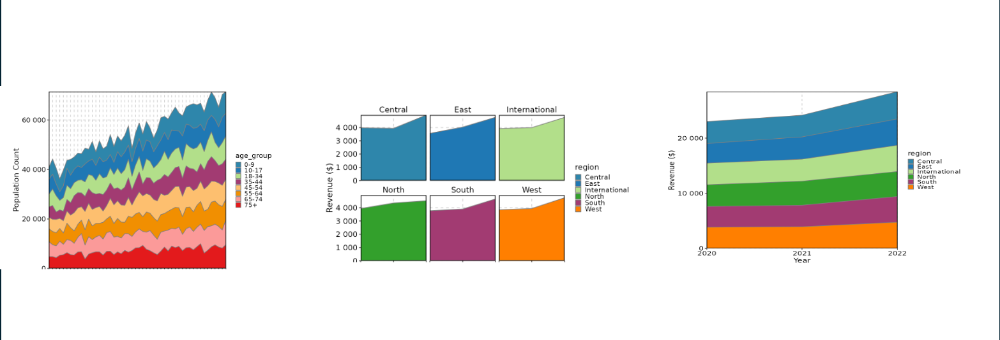
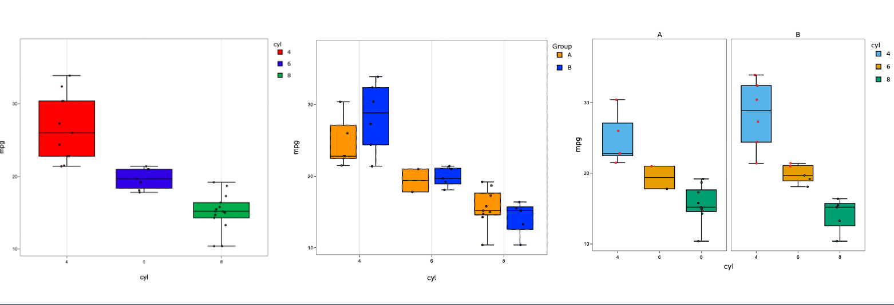
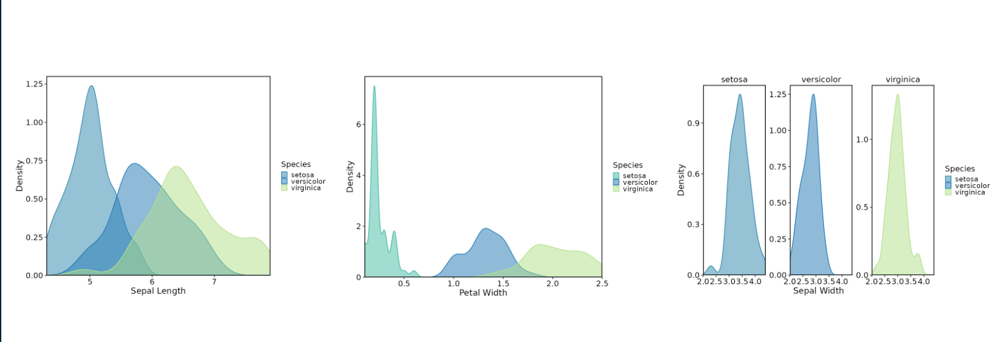
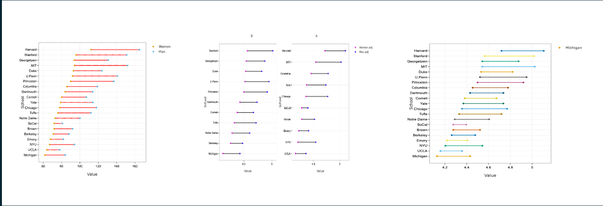
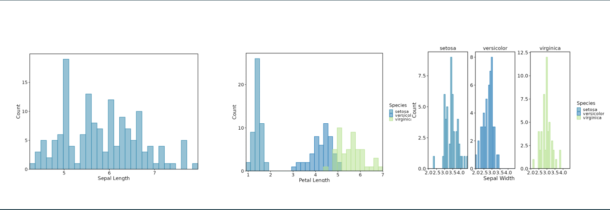
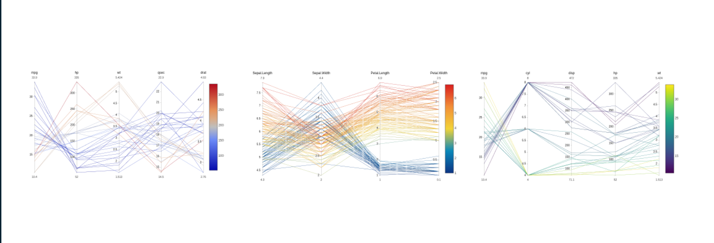
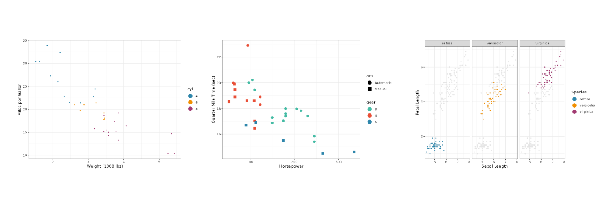

# VizModules

This package utilizes various viz packages (currently
[dittoViz](https://github.com/dtm2451/dittoViz) and
[plotthis](https://github.com/pwwang/plotthis)) to create
interactivity-first Shiny modules for common plot types, designed to
serve as building blocks for Shiny apps and as the basis for more
complex/specialized modules.

These modules will contain all possible functionality for each plot with
some additional parameters that make use of the interactive features of
plotly, e.g. interactive text annotations, arbitrary shape annotations,
multiple download formats, etc.

The modules provide comprehensive plot control for app users, allowing
for convenient aesthetic customizations and publication-quality images.
They also provide developers a way to dramatically save time and reduce
complexity of their plotting code or a flexible base to build more
specialized Shiny modules upon.

## Install

Note that this package is in development and may break at any time.

Currently, the package can be installed from Github:

``` r
devtools::install_github("j-andrews7/VizModules")
```

## Quick Start

- Explore the hosted gallery:
  <https://j-andrews7-vizmodules.share.connect.posit.cloud/>
- Run the same gallery locally:
  `shiny::runApp(system.file("apps/module-gallery", package = "VizModules"))`
- See the vignette for a full walkthrough:
  [`vignette("quick-start", package = "VizModules")`](https://j-andrews7.github.io/VizModules/articles/quick-start.html)

``` r
library(VizModules)

ui <- fluidPage(
    sidebarLayout(
        sidebarPanel(
            dittoViz_ScatterPlotInputsUI(
                "cars",
                mtcars,
                defaults = list(
                    x.by = "wt",
                    y.by = "mpg",
                    color.by = "cyl"
                )
            )
        ),
        mainPanel(dittoViz_ScatterPlotOutputUI("cars"))
    )
)

server <- function(input, output, session) {
    dittoViz_ScatterPlotServer(
        "cars",
        data = reactive(mtcars),
        hide.inputs = c("rows.use"),
        hide.tabs = c("Plotly")
    )
}

shinyApp(ui, server)
```

Every module uses the same trio of functions: `*InputsUI()` for
controls, `*OutputUI()` for the plot, and `*Server()` for the logic. Use
`defaults` to pre-fill inputs, and `hide.inputs`/`hide.tabs` to hide
controls while keeping their values so you can enforce app-level
defaults without exposing them.

Modules built on plotting functions from other packages expose most of
the underlying arguments. The module input help pages (e.g.,
`?dittoViz_ScatterPlotInputsUI`,
[`?plotthis_AreaPlotInputsUI`](https://j-andrews7.github.io/VizModules/reference/plotthis_AreaPlotInputsUI.md))
list what is wired through and any omissions; cross-reference the
underlying plot docs
([`?dittoViz::scatterPlot`](https://rdrr.io/pkg/dittoViz/man/scatterPlot.html),
[`?plotthis::AreaPlot`](https://pwwang.github.io/plotthis/reference/AreaPlot.html),
etc.) to see the full parameter set.

## Building Custom Wrapper Modules

The modules in **VizModules** are designed to be composed and extended.
You can build higher-level modules that add custom logic while reusing
the full functionality of the base modules.

**Key points when building wrapper modules:**

1.  **Namespace handling**: Use `NS(id)` for your wrapper’s custom
    inputs, and pass the bare `id` (not namespaced) to the base module’s
    UI and server functions.

2.  **Data processing pattern**: Process your data inside a
    [`moduleServer()`](https://rdrr.io/pkg/shiny/man/moduleServer.html)
    block to access your wrapper’s namespaced inputs, then call the base
    module’s server function *outside* that block to avoid
    double-namespacing.

3.  **Reactive data**: Always pass reactive expressions to both your
    wrapper and the underlying module servers.

For more details, see
[`vignette("custom-modules", package = "VizModules")`.](https://j-andrews7.github.io/VizModules/articles/custom-modules.html)

## Modules Provided

Currently, **VizModules** contains a functional Shiny module for the
following visualization functions:

### `dittoViz`

- `dittoViz_scatterPlot` - x/y coordinate plots with additional color
  and shape encodings (wraps
  [`dittoViz::scatterPlot`](https://rdrr.io/pkg/dittoViz/man/scatterPlot.html)).
- `dittoViz_yPlot` - Multi-variate Y-axis plots (wraps
  [`dittoViz::yPlot`](https://rdrr.io/pkg/dittoViz/man/yPlot.html)).

### `plotthis`

- `plotthis_AreaPlot` - Stacked area charts (wraps
  [`plotthis::AreaPlot`](https://pwwang.github.io/plotthis/reference/AreaPlot.html)).
- `plotthis_ViolinPlot` - Violin plots (wraps
  [`plotthis::ViolinPlot`](https://pwwang.github.io/plotthis/reference/boxviolinplot.html)).
- `plotthis_BoxPlot` - Box plots (wraps
  [`plotthis::BoxPlot`](https://pwwang.github.io/plotthis/reference/boxviolinplot.html)).
- `plotthis_BarPlot` - Bar charts (wraps
  [`plotthis::BarPlot`](https://pwwang.github.io/plotthis/reference/barplot.html)).
- `plotthis_SplitBarPlot` - Split bar charts (wraps
  [`plotthis::SplitBarPlot`](https://pwwang.github.io/plotthis/reference/barplot.html)).
- `plotthis_DensityPlot` - Density plots (wraps
  [`plotthis::DensityPlot`](https://pwwang.github.io/plotthis/reference/densityhistoplot.html)).
- `plotthis_Histogram` - Histograms (wraps
  [`plotthis::Histogram`](https://pwwang.github.io/plotthis/reference/densityhistoplot.html)).

### Defined in VizModules

- `linePlot` - Line plots with customizable trajectories.
- `piePlot` - Pie and donut charts.
- `radarPlot` - Radar Plot
- `parallelCoordinatePlot`
- `ternaryPlot`
- `dumbbellPlot`
- `volcanoPlot` - Volcano plots for differential expression analysis
  (extends `dittoViz_scatterPlot`).

## Modules Planned

### `dittoViz`

- **scatterHex** - hexbin plots encoding density/frequency information
  along x/y coordinates.
- **barPlot** - compositional barplots.
- **freqPlot** - box/jitter plots for discrete observation frequencies
  per sample/group.

dittoViz is under active development, so additional modules will be
created as more visualization functions are added.

## Contributing a New Module

To contribute a new module to the package, see the vignette for
guidelines:
[`vignette("adding-a-new-module", package = "VizModules")`](https://j-andrews7.github.io/VizModules/articles/adding-a-new-module.html)

## Examples of Plots:

[linePlot:](https://j-andrews7.github.io/VizModules/reference/linePlotApp.html)


[plotthis_AreaPlot:](https://j-andrews7.github.io/VizModules/reference/plotthis_AreaPlotApp.html)

[(Source Plotting
Function)](https://pwwang.github.io/plotthis/reference/AreaPlot.html)



[plotthis_BoxPlot:](https://j-andrews7.github.io/VizModules/reference/plotthis_BoxPlotApp.html)

[(Source Plotting
Function)](https://pwwang.github.io/plotthis/reference/boxviolinplot.html)



[plotthis_DensityPlot:](https://j-andrews7.github.io/VizModules/reference/plotthis_DensityPlotApp.html)

[(Source Plotting
Function)](https://pwwang.github.io/plotthis/reference/densityhistoplot.html)



[dumbellPlot:](https://j-andrews7.github.io/VizModules/reference/dumbbellPlotApp.html)



[plotthis_HistogramPlot:](https://j-andrews7.github.io/VizModules/reference/plotthis_HistogramApp.html)

[(Source Plotting
Function)](https://pwwang.github.io/plotthis/reference/densityhistoplot.html)



[parallelCoordinatePlot:](https://j-andrews7.github.io/VizModules/reference/parallelCoordinatesPlotApp.html)



[piePlot:](https://j-andrews7.github.io/VizModules/reference/piePlotApp.html)


[radarPlot:](https://j-andrews7.github.io/VizModules/reference/radarPlotApp.html)


[dittoViz_ScatterPlot:](https://j-andrews7.github.io/VizModules/reference/dittoViz_scatterPlotApp.html)

[(Source Plotting
Function)](https://cran.r-project.org/web/packages/dittoViz/refman/dittoViz.html)



[plotthis_SplitBarPlot:](https://j-andrews7.github.io/VizModules/reference/plotthis_SplitBarPlotApp.html)

[(Source Plotting
Function)](https://pwwang.github.io/plotthis/reference/barplot.html)


[ternaryPlot:](https://j-andrews7.github.io/VizModules/reference/ternaryPlotApp.html)


[plotthis_ViolinPlot:](https://j-andrews7.github.io/VizModules/reference/plotthis_ViolinPlotApp.html)

[(Source Plotting
Function)](https://pwwang.github.io/plotthis/reference/boxviolinplot.html)


[dittoViz_yPlot:](https://j-andrews7.github.io/VizModules/reference/dittoViz_yPlotApp.html)

[(Source Plotting
Function)](https://cran.r-project.org/web/packages/dittoViz/refman/dittoViz.html)


### UI Overview:


Developed by [Jared Andrews](https://github.com/j-andrews7) and \[Jacob
Martin\]\[<https://github.com/Jacob1106>\]
