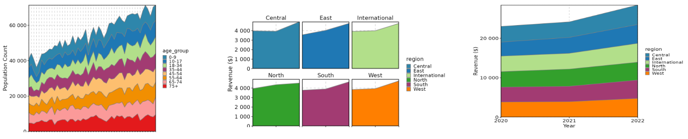
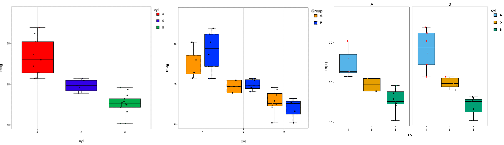
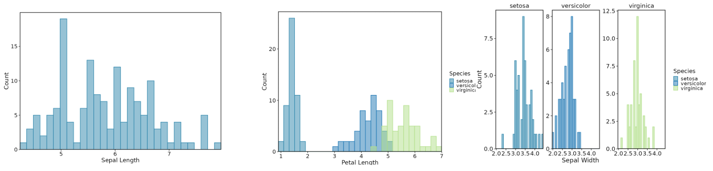
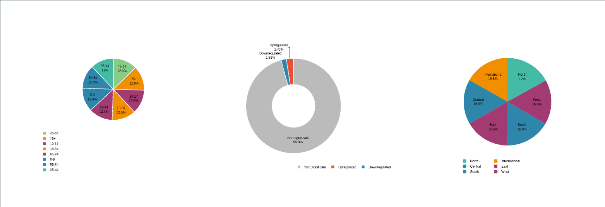
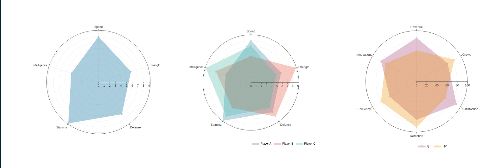
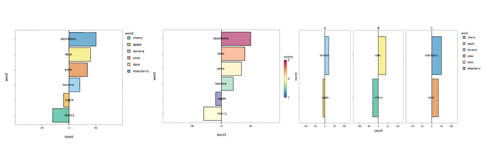
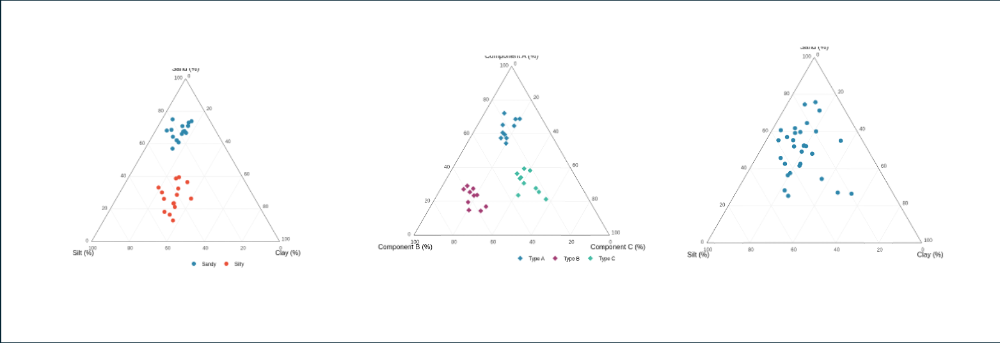
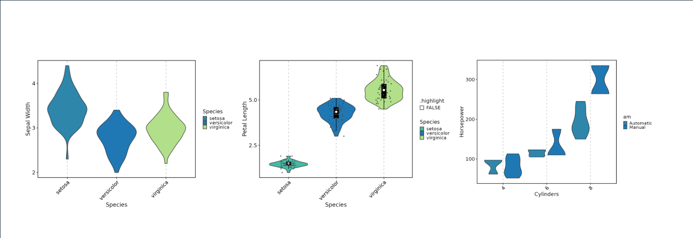
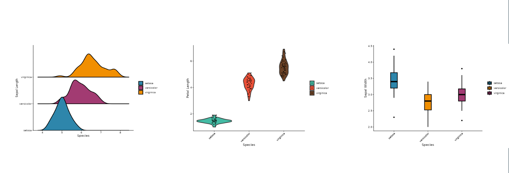
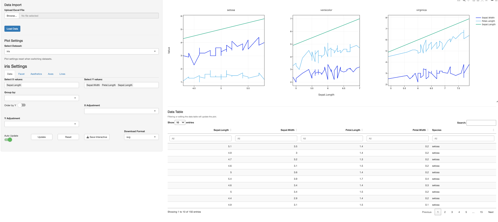

# VizModules

This package utilizes various viz packages (currently
[dittoViz](https://github.com/dtm2451/dittoViz) and
[plotthis](https://github.com/pwwang/plotthis) along with native
plotting functions) to create interactivity-first Shiny modules for
common plot types, designed to serve as building blocks for Shiny apps
and as the basis for more complex/specialized modules.

These modules contain all possible functionality for each plot with some
additional parameters that make use of the interactive features of
plotly, e.g. interactive text annotations, arbitrary shape annotations,
multiple download formats, etc.

The modules provide comprehensive plot control for app users, allowing
for convenient aesthetic customizations and publication-quality images.
They also provide developers a way to dramatically save time and reduce
complexity of their plotting code or a flexible base to build more
specialized Shiny modules upon.

## Install

Note that this package is in development and may contain bugs and
general wonkiness.

Currently, the package can be installed from Github:

``` r
devtools::install_github("j-andrews7/VizModules")
```

## Quick Start

- Explore the hosted example gallery:
  <https://j-andrews7-vizmodules.share.connect.posit.cloud/>
- Run the same gallery locally after installation:
  `shiny::runApp(system.file("apps/module-gallery", package = "VizModules"))`
- See the vignette for a full walkthrough:
  [`vignette("quick-start", package = "VizModules")`](https://j-andrews7.github.io/VizModules/articles/quick-start.html)

### Using Modules in Your Own App

To use a module in your own app, simply call the `*InputsUI()`,
`*OutputUI()`, and `*Server()` functions for the module you want to use.
For example, to use the ScatterPlot module from dittoViz, you would do
something like this:

``` r
library(VizModules)

ui <- fluidPage(
    sidebarLayout(
        sidebarPanel(
            dittoViz_ScatterPlotInputsUI(
                "cars",
                mtcars,
                defaults = list(
                    x.by = "wt",
                    y.by = "mpg",
                    color.by = "cyl"
                )
            )
        ),
        mainPanel(dittoViz_ScatterPlotOutputUI("cars"))
    )
)

server <- function(input, output, session) {
    dittoViz_ScatterPlotServer(
        "cars",
        data = reactive(mtcars)
    )
}

shinyApp(ui, server)
```

Every module uses the same trio of functions: `*InputsUI()` for
controls, `*OutputUI()` for the plot, and `*Server()` for the logic. The
separation of InputsUI and OutputUI allows you to place input controls
and the actual plot wherever you’d like.

Use `defaults` to pre-fill inputs, and `hide.inputs`/`hide.tabs` to hide
controls while keeping their values so you can enforce app-level
defaults without exposing them.

Modules built on plotting functions from other packages expose most of
the underlying arguments. The module input help pages (e.g.,
`?dittoViz_ScatterPlotInputsUI`,
[`?plotthis_AreaPlotInputsUI`](https://j-andrews7.github.io/VizModules/reference/plotthis_AreaPlotInputsUI.md))
list what is wired through and any omissions; cross-reference the
underlying plot docs
([`?dittoViz::scatterPlot`](https://rdrr.io/pkg/dittoViz/man/scatterPlot.html),
[`?plotthis::AreaPlot`](https://pwwang.github.io/plotthis/reference/AreaPlot.html),
etc.) to see the full parameter set.

### Example Apps for Each Module

Every module has a corresponding `*App()` function that creates a
complete Shiny app showcasing the module’s functionality with example
data. For instance,
[`plotthis_BarPlotApp()`](https://j-andrews7.github.io/VizModules/reference/plotthis_BarPlotApp.md)
creates an app BarPlot module. You can run these apps directly to
explore the module’s features and see how it works in a full Shiny
context.

``` r
library(VizModules)
# Using built-in example data (or upload your own file in the app)
plotthis_BarPlotApp()

# Providing your own data
df <- data.frame(
    category = c("A", "B", "C"),
    value = c(10, 20, 15),
    group = c("X", "Y", "X")
)

plotthis_BarPlotApp(data = df)
```

## App Factory

Every built-in `*App()` convenience function
(e.g. [`plotthis_BarPlotApp()`](https://j-andrews7.github.io/VizModules/reference/plotthis_BarPlotApp.md),
[`linePlotApp()`](https://j-andrews7.github.io/VizModules/reference/linePlotApp.md))
is a thin wrapper around
[`createModuleApp()`](https://j-andrews7.github.io/VizModules/reference/createModuleApp.md)
with sensible default data. You can also pass your own custom wrapper
module functions to
[`createModuleApp()`](https://j-andrews7.github.io/VizModules/reference/createModuleApp.md)
for rapid prototyping after defining the UI and server functions.

``` r
library(VizModules)

app <- createModuleApp(
    inputs_ui_fn = plotthis_BarPlotInputsUI,
    output_ui_fn = plotthis_BarPlotOutputUI,
    server_fn    = plotthis_BarPlotServer,
    data_list    = list("cars" = mtcars),
    title        = "My Bar Plot"
)

runApp(app)
```

## Building Custom Wrapper Modules

The modules in **VizModules** are designed to be composed and extended.
You can build higher-level modules that add custom logic while reusing
the full functionality of the base modules.

For more details, see
[`vignette("custom-modules", package = "VizModules")`.](https://j-andrews7.github.io/VizModules/articles/custom-modules.html)

## Modules Provided

Currently, **VizModules** contains a functional Shiny module for the
following visualization functions:

### `dittoViz`

- `dittoViz_scatterPlot` - x/y coordinate plots with additional color
  and shape encodings (wraps
  [`dittoViz::scatterPlot`](https://rdrr.io/pkg/dittoViz/man/scatterPlot.html)).
- `dittoViz_yPlot` - Multi-variate Y-axis plots (boxplot, jitter,
  violinplots - wraps
  [`dittoViz::yPlot`](https://rdrr.io/pkg/dittoViz/man/yPlot.html)).

### `plotthis`

- `plotthis_AreaPlot` - Stacked area charts (wraps
  [`plotthis::AreaPlot`](https://pwwang.github.io/plotthis/reference/AreaPlot.html)).
- `plotthis_ViolinPlot` - Violin plots (wraps
  [`plotthis::ViolinPlot`](https://pwwang.github.io/plotthis/reference/boxviolinplot.html)).
- `plotthis_BoxPlot` - Box plots (wraps
  [`plotthis::BoxPlot`](https://pwwang.github.io/plotthis/reference/boxviolinplot.html)).
- `plotthis_BarPlot` - Bar charts (wraps
  [`plotthis::BarPlot`](https://pwwang.github.io/plotthis/reference/barplot.html)).
- `plotthis_SplitBarPlot` - Split bar charts (wraps
  [`plotthis::SplitBarPlot`](https://pwwang.github.io/plotthis/reference/barplot.html)).
- `plotthis_DensityPlot` - Density plots (wraps
  [`plotthis::DensityPlot`](https://pwwang.github.io/plotthis/reference/densityhistoplot.html)).
- `plotthis_Histogram` - Histograms (wraps
  [`plotthis::Histogram`](https://pwwang.github.io/plotthis/reference/densityhistoplot.html)).

### Plotting Functions Defined in VizModules

Via direct use of plotly.

- `linePlot` - Line plots
- `piePlot` - Pie and donut plots
- `radarPlot` - Radar plots
- `parallelCoordinatePlot` - Parallel coordinate plots
- `ternaryPlot` - Ternary plots
- `dumbbellPlot` - Dumbbell plots

## Statistical Testing

The **BoxPlot**, **ViolinPlot**, and **yPlot** modules include a
**Stats** tab that adds pairwise statistical testing with bracket
annotations directly on the plotly figure.

### Supported Tests

- **Pairwise**: Wilcoxon rank-sum test, t-test (paired or unpaired)
- **Omnibus**: Kruskal-Wallis, ANOVA

### Features

- Bracket annotations with capped or flat style, placed via an interval
  packing algorithm to minimize vertical space
- Multiple display modes: adjusted p-values, raw p-values, or
  significance symbols (`*`, `**`, `***`, `****`)
- P-value correction via any `p.adjust` method (Holm, Bonferroni, BH,
  etc.)
- Configurable significance threshold, bracket spacing, inset, and line
  styling
- Per-facet testing: run tests independently within each facet panel, or
  across the full dataset
- Nested grouping: compare `group.by` levels within each x-axis category
- Omnibus test results shown as a draggable text annotation
- Download computed statistics as a CSV with metadata header (correction
  method, threshold, symbol legend)

### Data Format for Paired Tests

When using paired tests (Wilcoxon signed-rank or paired t-test), each
group must have the **same number of observations** in corresponding
order. Data should be sorted so that paired samples align row-by-row
within each group.

## Modules Planned

### `dittoViz`

- **scatterHex** - hexbin plots encoding density/frequency information
  along x/y coordinates.
- **barPlot** - compositional barplots.
- **freqPlot** - box/jitter plots for discrete observation frequencies
  per sample/group.

[dittoViz](https://github.com/dtm2451/dittoViz) is under active
development, so additional modules may be addedas more visualization
functions are added.

## Contributing a New Module

To contribute a new module to the package, see the vignette for clear
guidelines:
[`vignette("adding-a-new-module", package = "VizModules")`](https://j-andrews7.github.io/VizModules/articles/adding-a-new-module.html)

## Available Modules

[linePlot:](https://j-andrews7.github.io/VizModules/reference/linePlotApp.html)


[plotthis_AreaPlot:](https://j-andrews7.github.io/VizModules/reference/plotthis_AreaPlotApp.html)

[(Source Plotting
Function)](https://pwwang.github.io/plotthis/reference/AreaPlot.html)



[plotthis_BoxPlot:](https://j-andrews7.github.io/VizModules/reference/plotthis_BoxPlotApp.html)

[(Source Plotting
Function)](https://pwwang.github.io/plotthis/reference/boxviolinplot.html)



[plotthis_DensityPlot:](https://j-andrews7.github.io/VizModules/reference/plotthis_DensityPlotApp.html)

[(Source Plotting
Function)](https://pwwang.github.io/plotthis/reference/densityhistoplot.html)


[dumbellPlot:](https://j-andrews7.github.io/VizModules/reference/dumbbellPlotApp.html)


[plotthis_HistogramPlot:](https://j-andrews7.github.io/VizModules/reference/plotthis_HistogramApp.html)

[(Source Plotting
Function)](https://pwwang.github.io/plotthis/reference/densityhistoplot.html)



[parallelCoordinatePlot:](https://j-andrews7.github.io/VizModules/reference/parallelCoordinatesPlotApp.html)


[piePlot:](https://j-andrews7.github.io/VizModules/reference/piePlotApp.html)



[radarPlot:](https://j-andrews7.github.io/VizModules/reference/radarPlotApp.html)



[dittoViz_ScatterPlot:](https://j-andrews7.github.io/VizModules/reference/dittoViz_scatterPlotApp.html)

[(Source Plotting
Function)](https://cran.r-project.org/web/packages/dittoViz/refman/dittoViz.html)


[plotthis_SplitBarPlot:](https://j-andrews7.github.io/VizModules/reference/plotthis_SplitBarPlotApp.html)

[(Source Plotting
Function)](https://pwwang.github.io/plotthis/reference/barplot.html)



[ternaryPlot:](https://j-andrews7.github.io/VizModules/reference/ternaryPlotApp.html)



[plotthis_ViolinPlot:](https://j-andrews7.github.io/VizModules/reference/plotthis_ViolinPlotApp.html)

[(Source Plotting
Function)](https://pwwang.github.io/plotthis/reference/boxviolinplot.html)



[dittoViz_yPlot:](https://j-andrews7.github.io/VizModules/reference/dittoViz_yPlotApp.html)

[(Source Plotting
Function)](https://cran.r-project.org/web/packages/dittoViz/refman/dittoViz.html)



### UI Example


